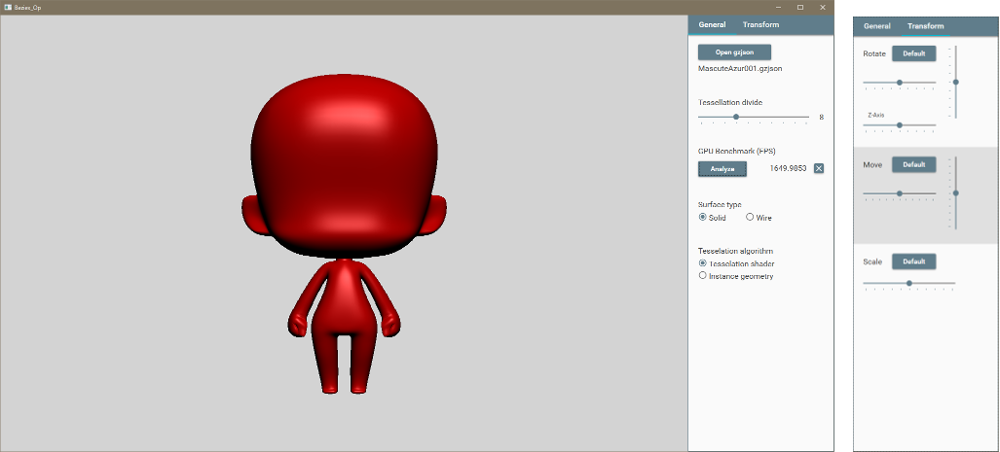
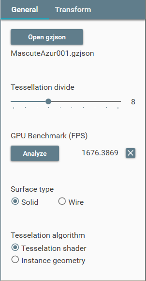
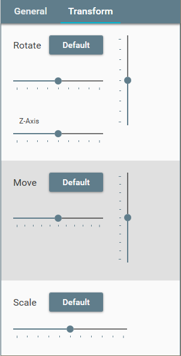

# Beziex_Op

This is a 3D model viewer (desktop application) that tessellates unique high-dimensional patches data in real time by OpenTK (C#) and displays it on a Windows PC. (Screenshot Left: Select "General" tab, Select "Transform" tab)

Beziex_Op は、独自の高次元パッチデータを OpenTK (C#) でリアルタイムにテッセレーションし、Windows PC 上に表示する3Dモデルビューワ (デスクトップアプリケーション) です。(スクリーンショット 左: "General" タブ選択時, 右: "Transform" タブ選択時)

<br>



ちなみに (スクリーンショット表示の) 元の 3D データとして、「クールなびじゅつかん館長」さんのデータ (CC0 1.0 Universal Public Domain Dedication) を使わせて頂きました。「クールなびじゅつかん館長」さん、ありがとうございます。

<a href="https://twitter.com/thecoolmuseum/status/785896516422471681">クールなびじゅつかん館長さんのツイート : (https://twitter.com/thecoolmuseum/status/785896516422471681)</a>

<br>

## Description ／ 簡単な説明

Original high-dimensional patches data is:

- Two adjacent patches are connected smoothly. (G1 connection)
- Converted from Catmull–Clark subdivision surface. It's a smooth surface approximating the subdivision shape.
- Corresponding to the creasing shape.
- But, Beziex_Op has not converter from subdivision data. The converter has not been released yet. (Intend to release it in open source)

Real-time tessellation algorithm is:

- It corresponds to algorithm using OpenGL4 tessellation shader and algorithm using only vertex shader and fragment shader.
- Algorithm using tessellation shader requires OpenGL4 or later. However, it is usually faster than algorithm that use only vertex and fragment shaders. 
- `GL.DrawElementsInstanced` function and a patch control point texture are used to tessellate with only these two shaders when algorithm that use only vertex and fragment shaders.

<br>

独自の高次元パッチデータについて:

- 隣接する2パッチ間は滑らかにつながります。(G1接続)
- このパッチデータは、Catmull–Clarkサブディビジョンサーフェイスを変換したもので、元のサブディビジョン形状にかなり近似しています。
- Catmull–Clarkサブディビジョンのクリース形状 (折れ曲がった部分) も変換できます。
- ただし Beziex_Op にはサブディビジョンからの変換機能はついていません。なおコンバータは既に作成済みですが、まだ公開していません。(オープンソースで公開予定)

リアルタイム テッセレーション アルゴリズムについて:

- OpenGL4 のテッセレーションシェーダを使ったアルゴリズムと、バーテックスシェーダとフラグメントシェーダだけを使用するアルゴリズムに対応しています。
- テッセレーションシェーダを使ったアルゴリズムは OpenGL4 以降が必要ですが、たいていの場合 バーテックスシェーダとフラグメントシェーダだけを使用するアルゴリズムよりも高速です。
- バーテックスシェーダとフラグメントシェーダだけを使用するアルゴリズムでは、この2シェーダだけでテッセレーションするために、`GL.DrawElementsInstanced` 関数とパッチ コントロールポイント テクスチャを使っています。

<br>

## Why do we need it? ／ なぜ Beziex_Op が必要？

3DCG ゲームには、「とてつもなく緻密なキャラ」のゲームもあれば、「とんでもなくローポリ」なモノもあります。もちろん「緻密なキャラ」の方が綺麗なのですが、ローポリのゲームがあるのも理由があったりするわけです。

このローポリとしなければならなかった理由として、GPU の能力不足、メモリ不足、ネット速度から来る制限、等が考えられるでしょう。この中で「GPU の能力不足」と「メモリ不足」はそのうち解決しそうですが、「ネット速度」は 5G になっても辛そう、という気がしてます。<br>
なおテクスチャの容量等も当然ネット速度に影響しますが、ここでは敢えて触れません。

ところで、OpenGL 等にはテッセレーションシェーダというものがあります（古いバージョンを除く）。正確には2種類のシェーダから成り立っているのですが、ここではまとめて考えます。<br>
なおこのシェーダは現時点では、まだ残念ながらディスプレイスメントマッピングぐらいにしか使われていないようです。しかし本当は、曲面パッチを細かなポリゴンに分割するのにとっても有効な代物なんです。ちなみに曲面パッチとは、ベジェ曲面やグレゴリーパッチ等のことを言います。

この曲面パッチはポリゴンよりも多くの情報を必要とするため、曲面パッチとポリゴンそれぞれ 1個をデータサイズで比較すると、当然曲面パッチの方が大きいです。しかし曲面パッチは、任意の細かさでポリゴンに分割（これをテッセレーションという）できるので、"ある程度の細かさ" まで分割すると、

- 「曲面パッチモデルで分割後の複数のポリゴン」と同数のポリゴンを持つポリゴンモデルの物体は、曲面パッチモデルの物体よりデータサイズが大きくなる。

という逆転現象が起きます。すなわちこれは、

- ハイポリゴン（小さなポリゴンがたくさん有る）レベルの物体であれば、曲面パッチの方がデータサイズが小さくなる可能性がある。
- そして曲面パッチの方は、さらに細かく分割可能

ということを意味します。<br>
つまり「一定以上の緻密なキャラで、データサイズを抑える」ためには、3D モデルのソース基礎形状をポリゴンでは無く、曲面パッチとした方が良いということです。そして Beziex_Op では、それが可能なのです。

<br>

## Operating environment ／ 動作環境

It only works on Windows PCs that support OpenGL4. .NET Framework 4.7.2 is required, but Windows 10 (1803) or later is supported as standard.
Operation has been confirmed in the following environment. 

OpenGL4 がサポートされた Windows PC (64bit) でのみ動作します。.NET Framework 4.7.2 が必要ですが、Windows 10 (1803) 以降であれば標準でサポートされています。<br>
下記の環境で動作確認しています。

- i7-6700HQ + GTX 970M + 64bit 版 Windows 10 Pro (1903)
- i5-7300HQ + GTX 1050Ti + 64bit 版 Windows 10 Home (1903) 

<br>

## Install environment for build / ビルド環境のインストール

ここでは Windows 上でのビルド方法について記します。なお Windows 10 (64bit) でしか検証していません。

<br>

### Beziex_Op の取得

既にこの README.md を、下記 URL の github 上でご覧になっていると思います。まずは一式を Clone もしくはダウンロードしてください。

<a href="https://github.com/beziex/priv-Beziex_Op">beziex/Beziex_Op [github] :  (https://github.com/beziex/priv-Beziex_Op)</a>

<br>

### Visual Studio 2019 のインストール

Beziex_Op は、Visual Studio 2019 を使います。お持ちでない場合は、下記サイトからダウンロードし、インストールしてください。個人であれば無料の Visual Studio Community 2019 が使えます。(Beziex_Op の開発は Community 版で行いました)

<a href="https://visualstudio.microsoft.com/ja/downloads/">Visual Studio 2019 :  Community 版もココからダウンロード</a>

<br>

## Building & Run ／ビルドと実行

Visual Studio 2019 を起動し、ビルド＆実行してください。Beziex_Op は複数のサードパーティ製ライブラリを使用していますが、ビルドの際 自動的に Nuget されると思います。

<br>

## Usage ／ 使い方

Beziex_Op を起動しただけでは 3D モデルは表示されていません。まずは

- General タブの「Open gzjson」ボタン

をクリックすると「ファイル Open ダイアログ」が開くので、適当な gzjson ファイル (Beziex_Op の 3D モデル) を選びます。ちなみに「ファイル Open ダイアログ」の初期ディレクトリは、github リポジトリ ルート直下の "_demo" フォルダになるようにしてあります。

<br>

またその他の使用方法は、以下の通りです。

Beziex_Op はリアルタイムにテッセレーションさせることが目的なので、General タブの「Tessellation divide スライダ」が最も重要と言えます。

<br>

### General タブ



<br>

<table>
<tr>
<th width="18%">Title／表示名</th>
<th width="60%">Description／説明</th>
</tr>
<tr>
<td>Open gzjson</td>
<td>gzjson ファイル (Beziex_Op の 3D モデル) を選択します。</td>
</tr>
<tr>
<td>Tessellation divide</td>
<td>パッチの分割数で、常に偶数分割となります。この Tessellation divide が Beziex_Op の肝です。</td>
</tr>
<tr>
<td>GPU Benchmark (FPS)</td>
<td>Analyze ボタンを押すと、使用している OpenGL ドロー系関数の実行速度を FPS で表示します (詳細は後述)。また右の X ボタンを押すと、実行速度の数値がクリアされます。</td>
</tr>
<tr>
<td>Surface type</td>
<td>シェーディング面表示、もしくはワイヤーフレーム表示を選択します。</td>
</tr>
<tr>
<td>Tessellation algorithm</td>
<td>"Tessellation shader" アルゴリズムと "Instance geometry" アルゴリズムのどちらを使うかを選択します (詳細は後述)。</td>
</tr>
</table>

<br>

### Transform タブ



<br>

<table>
<tr>
<th width="18%">Title／表示名</th>
<th width="22%">Control／コントロール</th>
<th width="60%">Description／説明</th>
</tr>
<tr>
<td rowspan="4">Rotate</td>
<td>Default ボタン</td>
<td>回転マトリックスの初期化。</td>
</tr>
<tr>
<td>上部横方向スライダ</td>
<td>Y軸周りに回転させます。</td>
</tr>
<tr>
<td>縦方向スライダ</td>
<td>X軸周りに回転させます。</td>
</tr>
<tr>
<td>下部横方向スライダ (Z-Axis)</td>
<td>Z軸周りに回転させます。</td>
</tr>
<tr>
<td rowspan="3">Move</td>
<td>Default ボタン</td>
<td>平行移動マトリックスの初期化。</td>
</tr>
<tr>
<td>横方向スライダ</td>
<td>X方向に平行移動させます。</td>
</tr>
<tr>
<td>縦方向スライダ</td>
<td>Y方向に平行移動させます。</td>
</tr>
<tr>
<td rowspan="2">Scale</td>
<td>Default ボタン</td>
<td>スケーリングマトリックスの初期化。</td>
</tr>
<tr>
<td>横方向スライダ</td>
<td>拡大縮小させます。</td>
</tr>
</table>

<br>

## Tessellation algorithm ／ テッセレーション・アルゴリズム

Beziex_Op では、2 種類の「曲面パッチ分割アルゴリズム」を切り替えれるようになっています。

<br>

### Tessellation shader アルゴリズム

テッセレーション系シェーダ、具体的にはテッセレーション・コントロールシェーダとテッセレーション・エバリュエーションシェーダ (それぞれ OpenGL での名称) を使用する曲面パッチ分割アルゴリズムです。<br>
このシェーダは OpenGL 4.0 (OpenGL ES 3.2) 以降でなければ使えませんが、テッセレーション専用のシェーダなので、(本シェーダを使用しない時と比べて) 多くの場合において高速です。

<br>

### Instance geometry アルゴリズム

この曲面パッチ分割アルゴリズムは、テッセレーション系シェーダを使用しません。その代わり、`GL.DrawElementsInstanced` 関数とパッチ コントロールポイント テクスチャを使います。

本アルゴリズムのメリットは、OpenGL 3.1 (OpenGL ES 3.0) 以降であれば使えることです。このバージョンであれば WebGL (無印 WebGL と WebGL2) に移植可能なので、実行可能な環境が広がることになります。<br>
ちなみに 無印 WebGL は OpenGL ES 2.0 ベースですが、多くの場合 拡張機能を使うことで、何とか動かすことが出来ます。

<br>

## GPU Benchmark (FPS) ／ GPU ベンチマーク (FPS)

始めに断っておきますが、Beziex_Op のベンチマークは「一つのフレームを作り上げるための全ての時間」を示すものではありません。

具体的には、
```
GL.GenQueries( 1, out fBenchmarkID );
GL.BeginQuery( QueryTarget.TimeElapsed, fBenchmarkID );
```
と
```
GL.EndQuery( QueryTarget.TimeElapsed );
```
の間に下記のコードを挟んでいるだけです。ただしこのままではナノ秒単位になるので、FPS 単位への変換を行っています。

<br>

<table>
<tr>
<td>Tessellation shader の場合</td>
<td>GL.DrawArrays( PrimitiveType.Patches, 0, Buf.NumVertices )</td>
</tr>
<tr>
<td>Instance geometry の場合</td>
<td>2 個の GL.DrawElementsInstanced( ... ) + α</td>
</tr>
<tr>
</table>

<br>

ちなみに一つのフレームを作り上げるためには、その他にも `SwapBuffers()` 等の CPU/GPU 処理が必要となるので、もっと時間が掛かります。

それに対し Beziex_Op では、OpenGL の Draw 系関数のみの GPU 時間を計っているわけです。なおシェーダは Draw 系関数が動いている際に実行されるので、これにより本ベンチマークは おおよそ「シェーダの実行時間」ということになります。<br>
なお今回の場合、２種類のアルゴリズムの実行時間の差異は、ほとんどシェーダコードの違いによるものです。要するに Draw 系関数以外の箇所では、実行時間はあまり変わらないはずです。<br>
つまりアルゴリズムの違いによる実行時間の差を見たいのであれば、Draw 系関数に関する GPU 時間を調べれば良いことになるので、このような仕様としました。

<br>

## License ／ ライセンス

<a href="https://opensource.org/licenses/MIT">MIT</a>

Copyright (c) 2019 beziex

<br>

## Dependency library ／ 使用ライブラリ

以下に、主だった使用ライブラリ (使用技術) を記述しました。ビルドの際、自動的に Nuget されます。

<br>

<table>
<tr>
<th width="15%">Name／名称</th>
<th width="15%">License／ライセンス</th>
<th width="70%">Description／説明</th>
</tr>
<tr>
<td>OpenTK</td>
<td>MIT</td>
<td>C# 用 OpenGL ラッパーライブラリ。<br>
<a href="https://opentk.net/">https://opentk.net/</a></td>
</tr>
<tr>
<td>Material Design In XAML</td>
<td>MIT</td>
<td>WPF 用 マテリアルデザイン ライブラリ。<br>
<a href="http://materialdesigninxaml.net/">http://materialdesigninxaml.net/</a></td>
</tr>
<tr>
<td>Dragablz</td>
<td>MIT</td>
<td>WPF 用 タブコントロール ライブラリ。<br>
<a href="https://github.com/ButchersBoy/Dragablz">https://github.com/ButchersBoy/Dragablz</a></td>
</tr>
<tr>
<td>Prism</td>
<td>MIT</td>
<td>WPF 用 MVVM フレームワーク。<br>
<a href="https://github.com/PrismLibrary/Prism">https://github.com/PrismLibrary/Prism</a></td>
</tr>
<tr>
<td>ReactiveProperty</td>
<td>MIT</td>
<td>WPF 用 リアクティブ プログラミング ライブラリ。<br>
<a href="https://github.com/runceel/ReactiveProperty">https://github.com/runceel/ReactiveProperty</a></td>
</tr>
<tr>
<td>XamlBehaviorsWpf</td>
<td>MIT</td>
<td>WPF 用 Behavior ライブラリ。<br>
<a href="https://github.com/Microsoft/XamlBehaviorsWpf">https://github.com/Microsoft/XamlBehaviorsWpf</a></td>
</tr>
<tr>
<td>Newtonsoft.Json</td>
<td>MIT</td>
<td>C# 用 JSONライブラリ。<br>
<a href="https://www.newtonsoft.com/json">https://www.newtonsoft.com/json</a></td>
</tr>
</table>

<br>

## Included 3D Data ／ 内包 3D データ

<br>

<table>
<tr>
<th width="15%">Name／名称</th>
<th width="15%">License／ライセンス</th>
<th width="70%">Description／説明</th>
</tr>
<tr>
<td>MascuteAzur001.gzjson<br>MascutePav001.gzjson</td>
<td>CC0 1.0</td>
<td><a href="https://twitter.com/thecoolmuseum/status/785896516422471681">
https://twitter.com/thecoolmuseum/status/785896516422471681</a></td>
</tr>
<tr>
<td>04_Cup1.gzjson<br>18_Ring0.gzjson<br>19_Sphere1.gzjson<br></td>
<td>CC0 1.0</td>
<td>beziex オリジナルの簡単な形状</td>
</tr>
<tr>
<td>Hippopotamus.gzjson</td>
<td>CC-BY 3.0</td>
<td>Poly by Google <a href="https://poly.google.com/view/4HNi8dZMdZa">
https://poly.google.com/view/4HNi8dZMdZa</a></td>
</tr>
<tr>
<td>Manatee_01.gzjson</td>
<td>CC-BY 3.0</td>
<td>Poly by Google <a href="https://poly.google.com/view/eOwLJiwAPJe">
https://poly.google.com/view/eOwLJiwAPJe</a></td>
</tr>
</table>
CC0 1.0 : パブリックドメイン

CC-BY 3.0 : 一般公開／リミックス可

<br>

これらの 3D データは、JSON を GZIP したものとなっています。

<br>

## More info ／ さらなる情報

### 間接的な技術資料

下記は、WebGL にて「Instance geometry アルゴリズム」を実装したプログラムに関する資料です。<br>
(WebGL なので) OpenTK とは少し書き方が違いますし、言語も TypeScript ですが、技術的には同じなので参考になると思います。

#### デモ

<a href="https://beziex.netlify.com/beziex_we/">
Beziex_We : (https://beziex.netlify.com/beziex_we/)</a>

<br>

#### デモの使い方

<a href="https://github.com/beziex/Beziex_We/blob/master/README.md#demo--usage--%E3%83%87%E3%83%A2%E3%81%A8%E4%BD%BF%E3%81%84%E6%96%B9">
デモと使い方 : (beziex/Beziex_We [github] のところの README.md 内)</a>

<br>

#### ソースコード（github）

<a href="https://github.com/beziex/Beziex_We">beziex/Beziex_We [github] :  (https://github.com/beziex/Beziex_We)</a>

#### Qiita

<a href="https://qiita.com/beziex/items/d3ad67752dba8cc355c7">Qiita：WebGL でテッセレーションして、曲面パッチ間が滑らかに繋がった物体を表示（１）</a>

<a href="https://qiita.com/beziex/items/d913102ca03266996a0e">Qiita：WebGL でテッセレーションして、曲面パッチ間が滑らかに繋がった物体を表示（２）</a>

<a href="https://qiita.com/beziex/items/00b614f7aa73f5124a19">Qiita：WebGL でテッセレーションして、曲面パッチ間が滑らかに繋がった物体を表示（番外編：法線について）</a>

<br>

